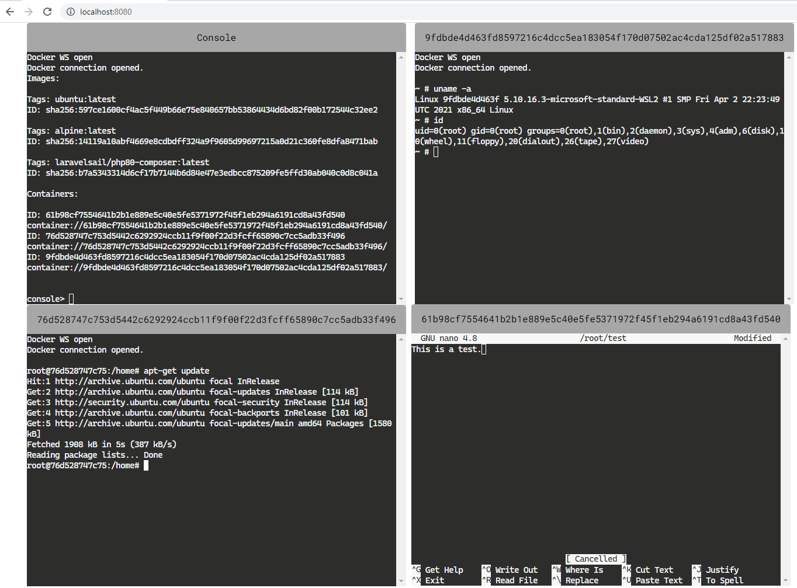

# dockerwm

This project is in alpha status. It is a proof-of-concept for managing Docker containers and images in the browser. It consists of a server, which interfaces with the Docker engine API and reports back to the browser using a WebSocket.

Functionality in the future can be extended to multiple Docker instances, adjustments of CPU quotas, and further variables outlined in the [Docker Engine API](https://docs.docker.com/engine/api/v1.24/)

## Instructions

1. `Setup Docker`
2. `pip3 install -r requirements.txt`
3. `python3 dockerwm.py`